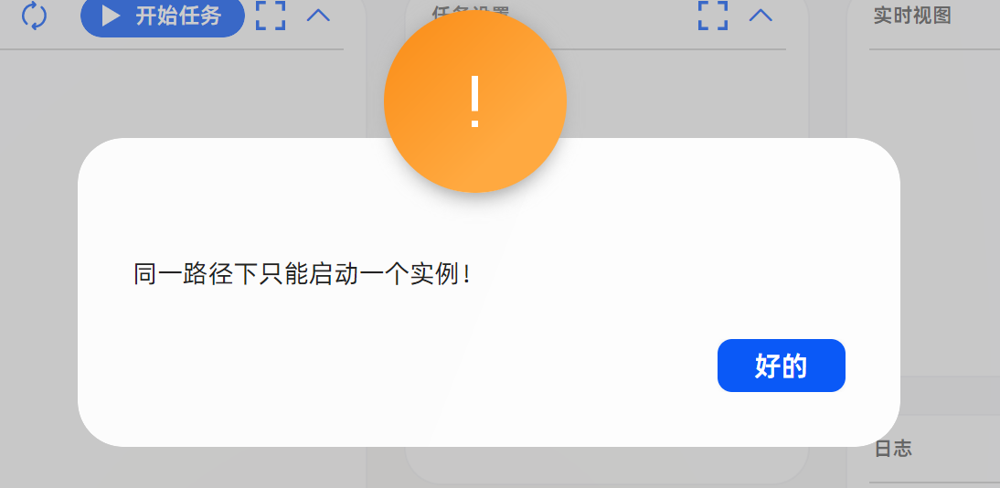
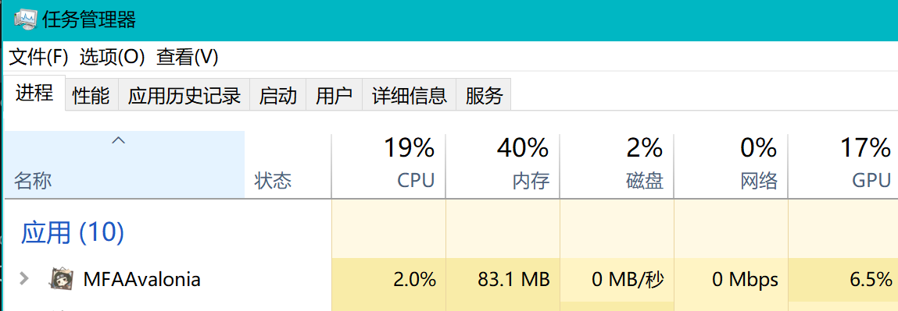
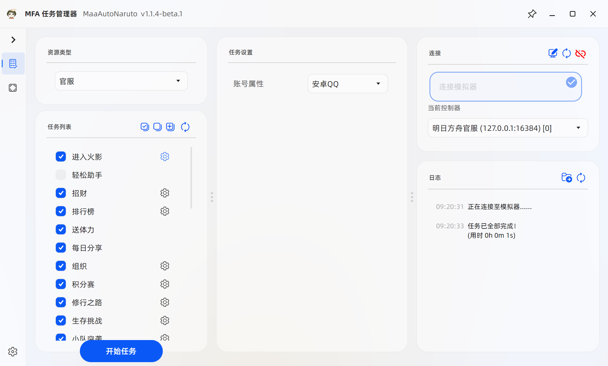
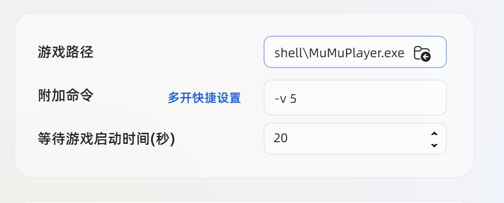

# 常见问题

[项目相关](#项目相关)

[无法启动](#无法启动)

[使用相关](#使用相关)

**[敲黑板](#敲黑板)**

## 项目相关

1. Q: 硬件配置有要求吗？
    <!-- 参考文献 -->
    <!-- https://mumu.163.com/help/20251216/35048_1276766.html -->
    <!-- 没找到火影的，找了个差不多类型的 -->
    A: 最低配置：CPU i5 9400 及以上，显卡 GTX 1650 Super 4G 独显及以上，内存8G及以上。

2. Q: 可以在手机上用吗？

    A: 不可以。

3. Q: 感觉没有xxx的xxx好用 / 为什么不做xxx功能？

    A: 开发组现在缺人，这些功能你来写吧。

4. Q: 打不开Github？

    A: 请使用科学上网忍具。

5. Q: 更新速度特别慢或无法更新？

    A: 可以试试[Mirror酱](https://mirrorchyan.com/zh/projects?rid=MaaAutoNaruto&os=windows&arch=x64&channel=stable)高速下载服务。

## 无法启动

1. Q: 双击exe后无反应或出现以下弹窗怎么办？

    

    A: 运行目录内的依赖安装脚本并重启电脑即可。

    

    Q: 脚本运行失败或者无法运行怎么办？

    A: [QQ群](1047724031)的群文件中有个名为`运行依赖`的文件夹，请手动下载并安装里面的**所有**程序。

    Q: 安装成功并重启后还是出现这个该弹窗怎么办？

    A: 将MAN目录下的文件全部删除，然后重新下载最新版的MAN。

2. Q: 解压后找不到exe或出现`此应用无法在你的电脑上运行`的提示

    A: 检查压缩包文件名是否带有`win-x86_64`字样。如果没有，就说明你下错了。

3. Q: 拖到桌面后启动不了

    A: 请看[如何创建快捷方式](https://www.bilibili.com/video/BV1oGwfedEGS)

4. Q: 如果是 MAC / Linux 用户，该如何使用？

    A: 请移步[M9A的用户手册](https://1999.fan/zh_cn/manual/newbie.html)自行学习相关解决方案。

5. Q: 同一路径下只能启动一个实例

    

    A: 如果需要多开，请单独复制一份打开

    Q：我确认我只开了一个但还是有这个提示

    A: 请在任务管理器中检查，之前关闭时是否还有进程残留。

    

## 无法连接模拟器

无法连接到模拟器请先按照以下步骤排查：

1. 直接点击开始任务，MFA会自动尝试重新搜索可用的模拟器。

2. 在`模拟器`的设置中开启`ADB`并关闭`网络桥接`。

3. 检查是否安装了“360手机助手”，“xxx刷机大师”，”应用宝”这种类型的软件，这些软件会占用adb。需要把他们都关闭并在`任务管理器`中检查后台是否干净。

4. 检查系统防火墙是否拦截了adb命令。

5. 如果是雷电模拟器，可以尝试在`MAN`的`连接设置`中将触控模式改为`MaaTouch`。

6. 重启电脑，系统会重置本地连接。

如果以上方案均不能解决问题，请[导出日志](./issue.md)进行反馈。

## 使用相关

1. Q: 推荐什么模拟器

    A: 推荐用mumu官方版，不要用定制版。而且强烈建议不要用雷电，因为bug非常多。

2. Q: 更新检测失败

    A: 试试[Mirror酱](https://mirrorchyan.com/zh/projects?rid=MaaAutoNaruto&os=windows&arch=x64&channel=stable)高速下载服务或自行前往GitHub仓库手动下载。

## 模拟器多开

### adb 连接

如图为软件主页面，右上角的连接是本节需要关注的部分。

adb（即 Android 调试桥），MFA 通过它来与模拟器建立连接，如果未成功配置，所有的任务都无法成功运行。

一般来说，你只需要在打开模拟器后点击刷新，便可以自动被搜索连接。手动配置可以参考M9A的[连接设置](https://1999.fan/zh_cn/manual/connection.html)

**注意**：多开情况下可能有多个控制器，请选择正确的控制器！可以在软件左侧切换第二个页面，在这里截图测试，判断是否正确连接。

### 打开软件时自动启动模拟器

通过软件左下角按键可以进入设置界面，这里的启动设置部分涉及启动前后的操作。

启动前的操作有`启动软件`和`启动软件并启动脚本`，这里的软件指模拟器，脚本指 MAN。

下面的**软件路径**，填对应模拟器的可执行文件，MuMu 模拟器的参考如下：

| MuMu12 模拟器(旧) | MuMu12 模拟器V5(新) |
| :---: | :---: |
| `{安装目录}\shell\MuMuPlayer.exe` | `{安装目录}\\nx_device\12.0\shell\MuMuNxDevice.exe` |

然后是**附加命令**，这里是正确启动多开模拟器的关键，填错的话基本都是启动的模拟器本体。

| 模拟器 | 命令格式 | 示例 |
| :---: | :---: | :---: |
| MuMu | `-v 多开号` | `-v 1` |
| 雷电 | `index=多开号` | `index=1` |

多开号从0开始，0代表模拟器本体，1代表第一个多开模拟器，依次类推。

以上内容就表示启动在MuMu第五个虚拟机。

（以上内容修改自M9A）

## 敲黑板

1. MaaAutoNaruto不喜欢站街特效的查克拉

    已经完全看不见字了！

    

2. MaaAutoNaruto不喜欢特殊轮盘忍者的查克拉

    目前已知的有：`波风水门[九喇嘛连结]`，`长十郎[六代目水影]`

    这些忍者的技能无法直接使用连点器触发。
