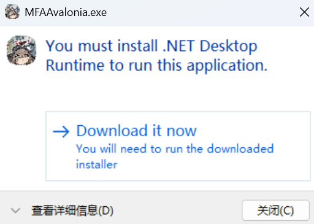

# 常见问题

[项目相关](#项目相关)

[无法启动](#无法启动)

[使用相关](#使用相关)

**[敲黑板](#敲黑板)**

## 项目相关

1. Q: 硬件配置有要求吗？
    <!-- 参考文献 -->
    <!-- https://mumu.163.com/help/20251216/35048_1276766.html -->
    <!-- 没找到火影的，找了个差不多类型的 -->
    A: 最低配置：CPU i5 9400 及以上，显卡 GTX 1650 Super 4G 独显及以上，内存8G及以上。

2. Q: 可以在手机上用吗？

    A: 不可以。

3. Q: 感觉没有xxx的xxx好用 / 为什么不做xxx功能？

    A: 开发组现在缺人，这些功能你来写吧。

## 无法启动

1. Q: 双击exe后无反应或出现以下弹窗怎么办？

    

    A: 运行目录内的依赖安装脚本并重启即可。

    

    Q: 脚本成功运行并重启后还是出现这个该弹窗怎么办？

    A: 将MAN目录下的文件全部删除，然后重新下载最新版的MAN。

2. Q: 拖到桌面后启动不了

    A: 请看[如何创建快捷方式](https://www.bilibili.com/video/BV1oGwfedEGS)

3. Q: 如果是 MAC / Linux 用户，该如何使用？

    A: 请移步[M9A的用户手册](https://1999.fan/zh_cn/manual/newbie.html)自行学习相关解决方案。

## 使用相关

1. Q: 推荐什么模拟器

    A: 推荐用mumu官方版，不要用定制版。而且强烈建议不要用雷电，因为bug非常多。

## 敲黑板

1. MaaAutoNaruto不喜欢站街特效的查克拉

    已经完全看不见字了！

    

2. MaaAutoNaruto不喜欢特殊轮盘忍者的查克拉

    目前已知的有：`波风水门[九喇嘛连结]`，`长十郎[六代目水影]`

    这些忍者的技能无法直接使用连点器触发。
