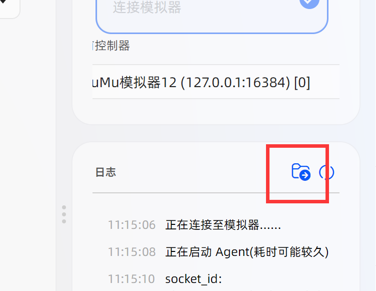

# 问题反馈

遇到问题时请先查询[常见问题](./faq.md)中是否有可用的解决方案。

如果你的问题不在常见问题当中，请导出日志并将日志文件发送给 QQ 群管理员，并提供出现问题时的MAN截图和火影当前界面截图，最好描述一下复现这个问题的方法，比如“在执行时候在什么情况下会在某个页面卡住”。当然，也可以开一个[issue](https://github.com/duorua/narutomobile/issues?q=sort%3Aupdated-desc+is%3Aissue+is%3Aopen)。

:::tip

导出的日志文件包含windows用户的路径（类似`C:/Users/用户名/AppData/Local/...`），如果你的用户名使用了真名，请考虑自行进行打码操作。

:::

:::warning

不要用`卡了`，`不动了`等模糊语言来描述问题，这不能解决任何问题。

:::

:::info

火影手游自身导致的异常，比如游戏闪退，画面异常等*真投入*问题与MAN无关，只能自行解决。

:::
